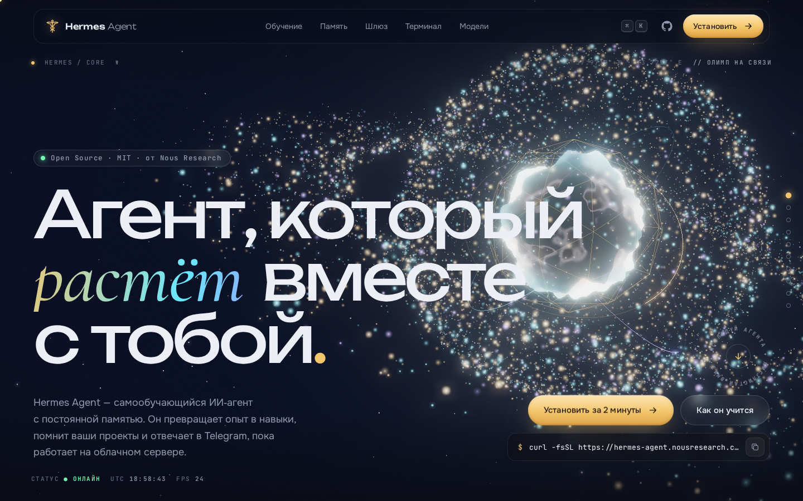
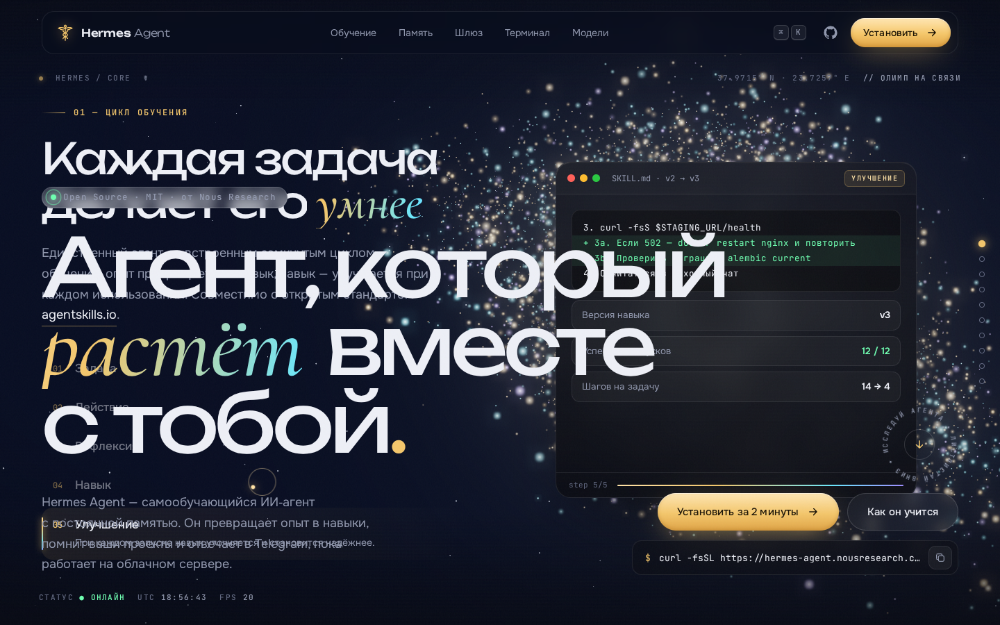

# ☤ Hermes Agent — 3D‑сайт

Неофициальный концепт‑сайт для [Hermes Agent](https://github.com/NousResearch/hermes-agent), open‑source агента от Nous Research, который учится на своих задачах.
Одна длинная страница: 3D‑сцена на WebGL, анимации при прокрутке и интерактивные демо.




## Как открыть

```bash
cd hermes-agent
python3 -m http.server 8080
# открыть http://localhost:8080
```

Можно и просто дважды кликнуть по `index.html`: локальные скрипты подключены обычными `<script>`, поэтому страница работает и через `file://`.
Нужен интернет: three.js, GSAP, Lenis и шрифты грузятся с CDN. Без него сайт показывает запасной градиентный фон, а всё интерактивное продолжает работать.

## Что внутри

| Секция | Что происходит |
| --- | --- |
| Прелоадер | Логотип‑кадуцей рисуется линией, счётчик 000→100, «загрузка» памяти, навыков и шлюза |
| Hero | 20 000 частиц, живое ядро с шумовой деформацией и iridescent‑шейдером, кометы на орбитах, bloom |
| Манифест | Слова загораются по мере прокрутки, счётчики статистики |
| 01 Обучение | Секция закрепляется, частицы складываются в **кадуцей с крыльями**, 5 шагов цикла: задача → действие → рефлексия → SKILL.md → улучшение |
| 02 Память | 3D‑стек из стеклянных слоёв памяти, **рабочий поиск по сессиям** (FTS‑подобный, с подсветкой и сводкой), модель пользователя |
| 03 Шлюз | Телефон, который меняет оформление под Telegram, Discord, Slack, WhatsApp, Signal, Email и CLI, и анимированные диалоги |
| 04 Терминал | **Интерактивный TUI**: `help`, `hermes`, `hermes model/tools/gateway/doctor/setup`, `/skills`, `/model`, чат с агентом, история ↑/↓, Tab‑автодополнение |
| 05 Возможности | Горизонтальная лента с анимированными визуализациями: субагенты, браузер, зрение, голос, MCP, Python RPC, траектории |
| 06 Автоматизация | **Парсер естественного языка → cron**: «каждую пятницу в 18:00 — отчёт в Slack» → `0 18 * * 5`, ближайшие запуски, YAML |
| 07 Среды | Bento‑сетка из 7 бэкендов со spotlight‑рамкой и 3D‑наклоном |
| 08 Модели | 3D‑карусель провайдеров, крутится мышью или пальцем |
| Установка | Вкладки по ОС, копирование команды в один клик |
| FAQ, финал | Плавный аккордеон, большой финальный CTA |

Что есть на всей странице: плавная прокрутка (Lenis), кастомный курсор, «магнитные» кнопки, прогресс‑бар, боковая навигация по главам, **командная палитра `⌘K` / `Ctrl+K` / `/`**, адаптив под мобильные и поддержка `prefers-reduced-motion`.

## Структура

```
hermes-agent/
├── index.html        разметка, SVG-спрайт иконок
├── css/style.css     дизайн-система, секции, адаптив
├── js/scene.js       WebGL: частицы (5 форм), ядро, кольца, звёзды, bloom
├── js/app.js         прокрутка, интерактив, терминал, cron, палитра
└── assets/favicon.svg
```

## Как настроить

- **Форма частиц для секции** задаётся атрибутом `data-shape`: `0` — сфера, `1` — кадуцей, `2` — нейросеть, `3` — орбиты, `4` — сетка, `5` — финальная сфера.
- **Положение 3D в секции** — атрибут `data-scene="x,y,core,dim"`: смещение сцены, размер ядра и яркость частиц. Так 3D не мешает читать текст.
- Цвета и шрифты лежат в переменных `:root` в начале `css/style.css`.

---

Hermes Agent — проект [Nous Research](https://nousresearch.com) под лицензией MIT. Этот сайт — неофициальный фан‑концепт.
